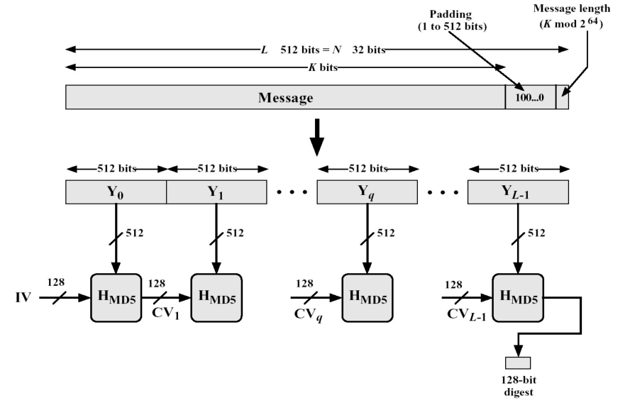
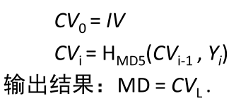
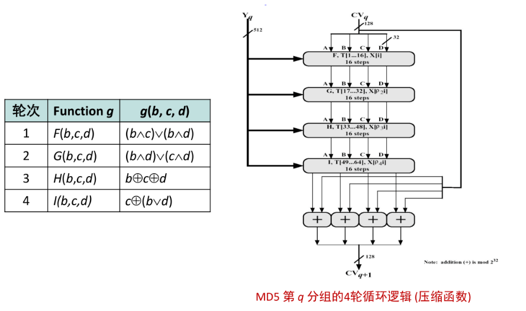
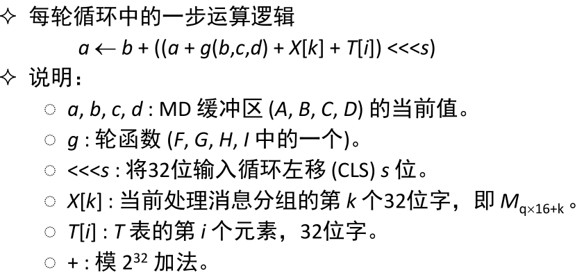
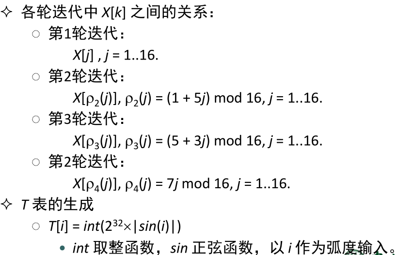

# MD5加密算法

## 概述

MD5 使用 little-endian，输入任意不定长度信息，以512位长进行分组，生成四个32位数据，最后联合起来输出固定128位长的信息摘要。

MD5 算法的基本过程为：求余、取余、调整长度、与链接变量进行循环运算、得出结果。

## 算法细节

### MD5的基本流程

### 步骤

1.  填充 padding

   在原始消息数据尾部填充标识 100…0，填充后的消息位数 L = 448 (mod 512)。补位操作始终要执行，即使补位前信息的长度对512求余的结果是448。至少要填充1个位，所以标识长度 1~512位。
   再向上述填充好的消息尾部附加原始消息长度值的低64位，最后得到一个长度 L 是512位整数倍的消息。

2.  分块

   把填充后的消息结果分割为 L 个512位的分组：Y 0 , Y 1 , …, Y L-1 。

   根据基本流程图，这些分组会依次参与MD5压缩函数。

3. 初始化

   初始化一个128位的 MD 缓冲区，记为 CV q ，也表示为4个32位寄存器 (A, B, C, D)；CV 0 = IV。迭代在 MD 缓冲区进行，最后一步的128位输出即为算法结果。

   寄存器 (A, B, C, D) 置16进制初值作为初始向量 IV，并采用小端存储 (little-endian) 的存储结构，初始值为：

   + A = 0x67452301
   + B = 0xEFCDAB89
   + C = 0x98BADCFE
   + D = 0x10325476

   看基本流程图。这个初始值IV会作为第一个压缩函数的输入，产生的结果会作为下一次压缩函数的输入。也就是说：以512位消息分组为单位，每一分组 Y q (q = 0, 1, …, L-1) 都会经过4个循环的压缩算法，表示为：

   

4. 信息处理，MD5压缩函数

   + 从 CV 输入128位，从消息分组输入512位，完成4轮循环后，输出128位，用于下一轮输入的 CV 值。
   + 每轮循环分别固定不同的生成函数 F, G, H, I，结合指定的 T 表元素 T[] 和消息分组的不同部分 X[] 做16 次运算，生成下一轮循环的输入。

   四个函数F, G, H, I以及压缩函数的流程分别为：

   ​       

   从上面压缩函数流程图可知：输入CV(q)会经过64次循环，每一次循环为：

   

   上图X[k]和T[i]的取值：

   

   ​

## 关于代码的几点说明

1. MD5实现步骤的第四步，压缩函数中每个输入要经过64次循环，每次循环参与的值都不一样。而在代码实现中，这64步是直接写出来的（没有用到循环），其中涉及到的x[k]、T[i]等值都是事先算好了的。

   代码实现中的`transform`函数就是压缩函数。

2. 代码实现封装了MD5算法为`class Md5 {};`。

3. `update(text)`函数可以多次调用，`hexdigest()`函数返回结果字符串，以十六进制表示。调用了`hexdigest()`函数之后会进行初始化（也就是说调用该函数后，此前的所有`update()`都会失效）。

4. 没有先调用`update(text)`函数就直接调用`hexdigest()`会报错，返回结果为空字符串。

5. 更多细节请浏览源代码。

## ABOUT

参考资料：[REC 1321](https://www.ietf.org/rfc/rfc1321.txt) 、[中文博客](http://www.cppblog.com/ant/archive/2007/09/11/31886.html)

AUTHOR：`ss2015_15331192_廖泽林_ws_assign_2`

